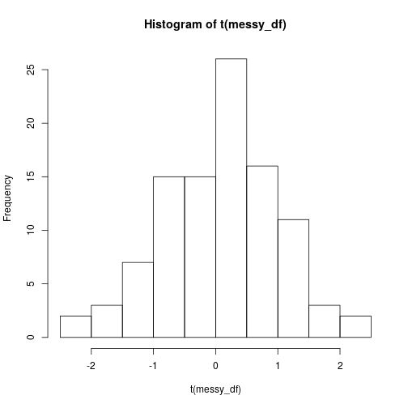
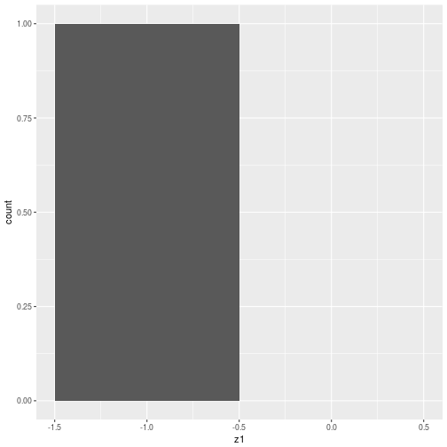
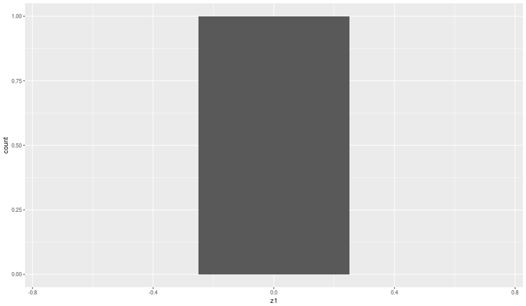
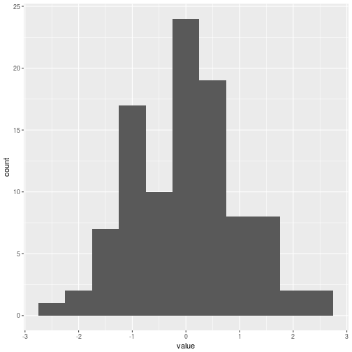

ggplot2
========================================================
author: Richel Bilderbeek
date: 2018-05-09
autosize: true

[https://github.com/richelbilderbeek/Science](https://github.com/richelbilderbeek/Science)  


Problem
========================================================


How to visualize data in R?

Goal
========================================================

- Share philosophy of `ggplot2`
- Try to convince '`ggplot2` is hard' is often incorrect
- Share biologically relevant examples


```r
library(ggplot2)
```

Philosophy
========================================================

 * Grammar of Graphics, by Wilkison
   * You will need to learn the grammar to express yourself
   * Then, the amount you can express yourself in is huge
 * 'Tidy Data', by Hadley Wickham

Messy data
========================================================


```r
messy_df <- data.frame(
  matrix(rnorm(n = 100), ncol = 100)
)
colnames(messy_df) <- paste0("z", seq(1, 100))
messy_df[1, 1:7] # Etcetera
```

```
          z1          z2      z3         z4         z5        z6        z7
1 -0.8044135 -0.02467601 0.39636 -0.9781095 -0.1012758 -1.393872 -1.184142
```

Plotting messy data is easy without ggplot2
========================================================


```r
hist(t(messy_df))
```



Plotting messy data is hard in ggplot2
========================================================


```r
ggplot(
  messy_df,
  aes(z1) # How to put other zs in here???
) + geom_histogram(binwidth = 1)
```



Plotting messy data is ugly in ggplot2
========================================================


```r
ggplot(
  data.frame(z = t(messy_df[1, ])[, 1]), # Transtransposition magic
  aes(z)
) + geom_histogram(binwidth = 0.5)
```



Tidy Data
========================================================

 * One measurement per row, 'long form'
 * Factors as factors


```r
library(tidyr)
```

Wrangling messy data to Tidy Data
========================================================


```r
df <- gather(messy_df, "z") # From tidyr
head(df) # Hey, one measurement per row!
```

```
   z       value
1 z1 -0.80441348
2 z2 -0.02467601
3 z3  0.39636003
4 z4 -0.97810952
5 z5 -0.10127583
6 z6 -1.39387214
```

Plotting Tidy Data is easy
========================================================


```r
ggplot(
  df,
  aes(value)
) + geom_histogram(binwidth = 0.5)
```




