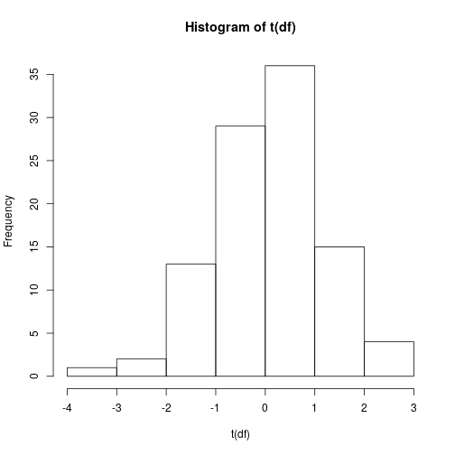
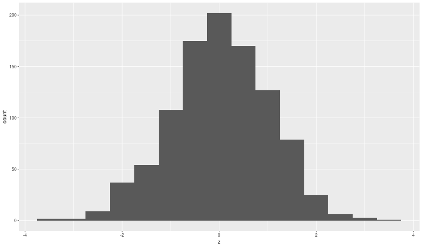
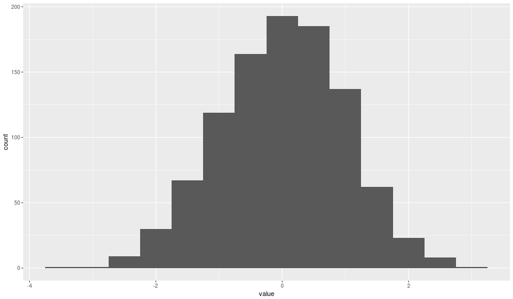
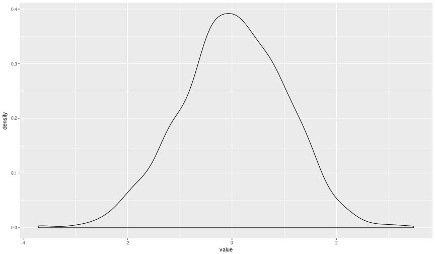
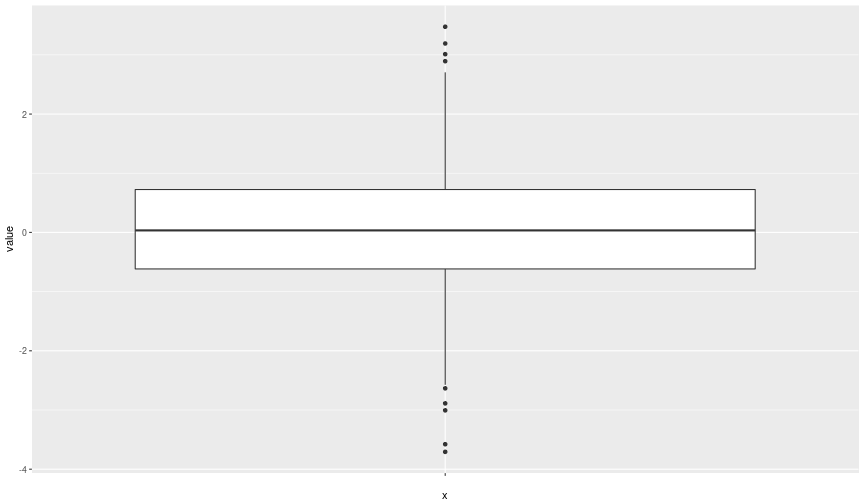
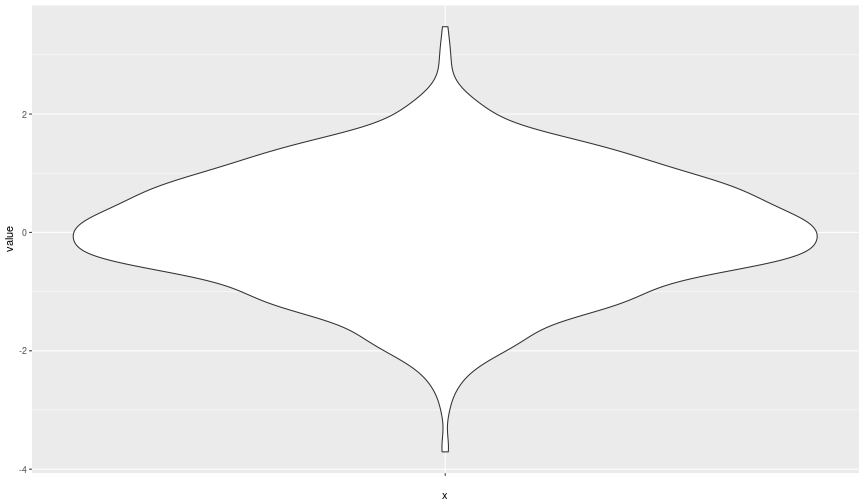

ggplot2
========================================================
author: Richel Bilderbeek
date: 2018-05-09
autosize: true

[https://github.com/richelbilderbeek/Science](https://github.com/richelbilderbeek/Science)  


Problem
========================================================



Goal
========================================================

- Share philosophy of `ggplot2`
- Try to convince '`ggplot2` is hard' is often incorrect
- Share biologically relevant examples


```r
library(ggplot2)
```

Philosophy
========================================================

 * Grammar of Graphics, by Wilkison
   * You will need to learn the grammar to express yourself
   * Then, the amount you can express yourself in is huge
 * 'Tidy Data', by Hadley Wickham

Messy data
========================================================


```r
messy_df <- data.frame(
  matrix(rnorm(n = 1000), ncol = 1000)
)
colnames(messy_df) <- paste0(
  "z", seq(1, 1000)
)
knitr::kable(messy_df[1, 1:6]) # Etcetera
```


|       z1|         z2|        z3|        z4|        z5|         z6|
|--------:|----------:|---------:|---------:|---------:|----------:|
| 0.042538| -0.9972975| 0.0557063| -1.026604| 0.7764313| -0.7226098|

Plotting messy data is easy without ggplot2
========================================================


```r
hist(t(messy_df))
```


Plotting messy data is hard in ggplot2
========================================================


```r
 # How to put other zs in here???
ggplot(
  messy_df, aes(z1)
) + geom_histogram(binwidth = 0.5)
```


Plotting messy data is ugly in ggplot2
========================================================


```r
# Transtransposition magic, avoid!
ggplot(
  data.frame(z = t(messy_df[1, ])[, 1]),
  aes(z)
) + geom_histogram(binwidth = 0.5)
```



Tidy Data
========================================================

 * One measurement per row, 'long form'
 * Factors as factors


```r
library(tidyr)
```

Wrangling messy data to Tidy Data
========================================================


```r
df <- gather(messy_df, "z") # From tidyr
knitr::kable(df[1:6, ]) # Hey, one measurement per row!
```


|z  |      value|
|:--|----------:|
|z1 |  0.0425380|
|z2 | -0.9972975|
|z3 |  0.0557063|
|z4 | -1.0266038|
|z5 |  0.7764313|
|z6 | -0.7226098|

Plotting Tidy Data is easy
========================================================


```r
ggplot(df, aes(value)) +
  geom_histogram(binwidth = 0.5)
```



Plotting Tidy Data is easy
========================================================


```r
ggplot(df, aes(x = value)) +
  geom_density()
```



Plotting Tidy Data is easy
========================================================


```r
ggplot(df, aes(x = "", y = value)) +
  geom_boxplot()
```



Plotting Tidy Data is easy
========================================================


```r
ggplot(df, aes(x = "", y = value)) +
  geom_violin()
```



