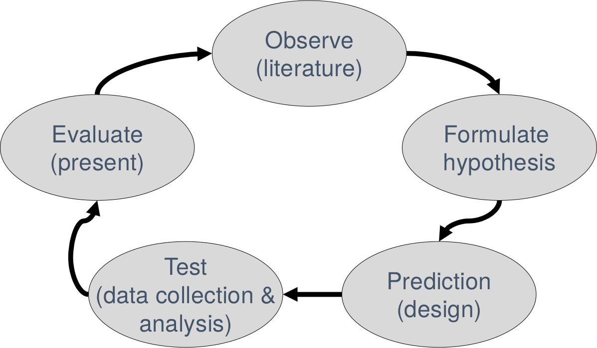
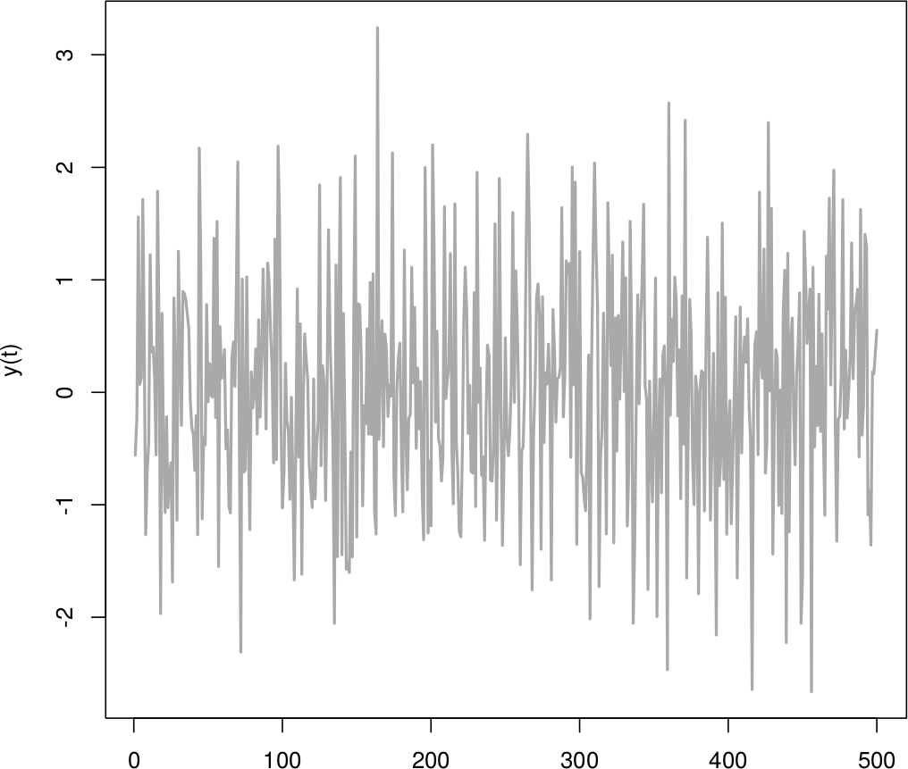
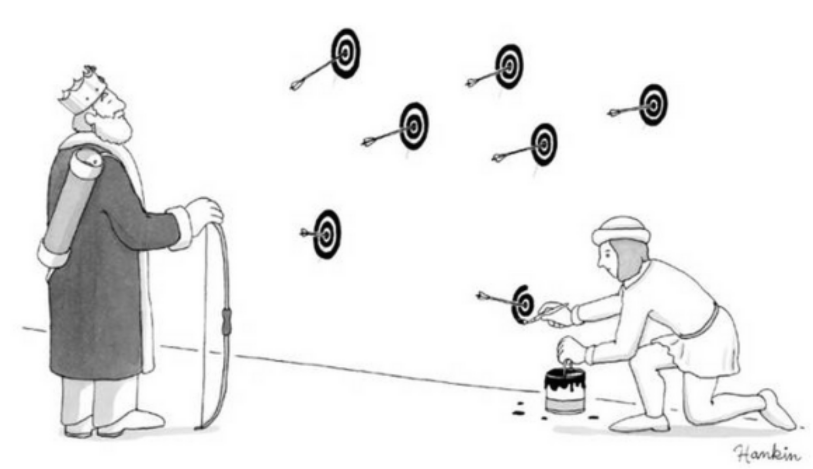

The Weak Spots in Contemporary Science (and How to Fix Them)
========================================================
author: Richel Bilderbeek
date: 2018-05-16
autosize: true

[https://github.com/richelbilderbeek/Science](https://github.com/richelbilderbeek/Science)  

1. Introduction
========================================================

***
Hypothetico-Deductive (H-D) model

*Picture from: The Weak Spots in Contemporary Science (and How
to Fix Them). JM Wicherts. 2017.*

1. Introduction
========================================================

***
'There are many reasons to believe [...] the stories are too good to be true.'

*Picture from: “Positive” Results Increase Down the Hierarchy of the Sciences. Daniele Fanelli. 2010*

2. Misconduct and Other Ways of Cutting Corners
========================================================

***
 * 2% fabricate results

*Picture from unknown source*

2. Misconduct and Other Ways of Cutting Corners
========================================================

***
 * HARK: Hypothesis After Results are Known
 * 'having seen the data, it is easy to attach a narrative'

*Picture from: The Weak Spots in Contemporary Science (and How
to Fix Them). JM Wicherts. 2017.*

3. Theoretical Bloopers and Selective Reading
========================================================

 * 'Improper rationales or needless repeating of earlier research could present a major waste of
resources'
 * 'a failure to systematically review all relevant evidence
might create situations in which research has already been done, is based on less strong evidence,
or would actually contradict earlier findings'

4. Improper Blinding and other Design Failures
========================================================

5. Analyzing the Data
========================================================

6. Reporting (or Failing to Report) the Evidence
========================================================

7. Researchers are Only Human
========================================================

 * bad intuition
 * confirmation bias
 * hindsight bias
 * 90% wants to do good
 * 30% did not always do good
 * 60% belief others are in it for selfish reasons

8. Solutions
========================================================

 * 'Most proposed solutions are based on [...] that researchers overwhelmingly want to do it well'
 * 'but if [...] stakeholders [...] reward only novel and positive results, systematic change will be a distant hope'

8.1. Transparency and Post-Publication Peer Review
========================================================

 * 'If research materials [...] and research data [...] were made openly available [...], the chances of being caught HARKing and conducting misconduct could be greatly enhanced'
 * 'Ideally, reviewers would consider transparency in their assessments of the validity of research
before publication'
 * 'post-publication review via online platforms [...]
could help later corrections for biases in research articles'

8.2. Pre-Registration and Registered Reports
========================================================

 * Pre-registration: 'researchers
explicate the hypotheses, design choices, and analytic approaches before starting the data collection'
 * Registered report: 'if reviewers are happy with the hypotheses, design, and analyses, the researchers [...] can set out to collect their data and analyze them as stipulated in advance. [...] the article is published regardless of whether the results are positive or not.'
 * 'any pre-registered study could still offer novel results based on explorations of the data'

8.3. Improved Training and Reporting Guidelines
========================================================

 * Increase awareness
 * Follow guidelines

8.4. Replication and Dealing with Publication Bias
========================================================

 * Funding and publications for replication studies
 * 'Only 36% of the replications yielded significant results, compared to 97% in the original studies'

8.5. Inferential Techniques, Power, and other Statistical Tools
========================================================

 * Null Hypothesis Significance Testing
   * widespread misinterpretations
   * low power
 * Alternatives: Bayesian
approaches, estimation and confidence intervals, more stringent nominal significance levels
 * Prevention of over-fitting

My view
========================================================

 * Main conclusion: researchers are only human
 * Main solution: register your work before collecting data

My view: software
========================================================

Effect|Statement
---|---
Arrogance|my code has no bugs
Ignorance|I think there are no bugs
Lack of testing|it just works
Opaque development process|already fixed it
Effects caused by bugs|yay, got a publication!
Fear of looking dumb|code can be requested by email

My view: social
========================================================

Effect|Statement
---|---
Pretending|sure, we checked that
Faking|sure, we already knew that
Seduction|these overly fancy slide transitions 
Social agression|are you flawless then?
Convincing|you are wise to agree with me
Fear of looking dumb|Overly complex slides

Questions?
========================================================

*Nullius in Verba* (Take no one's word)

'*Science means never having to say “trust me”*'. Simine Vazire
 
A Checklist to Avoid p-Hacking: Hypothesizing
========================================================

Degrees of Freedom in Planning, Running, Analyzing, and Reporting Psychological Studies. Wicherts, et al., 2016

Code|Related|Type of degrees of freedom
---|---|------------------------------
T1|R6|Conducting explorative research without any hypothesis
T2|  |Studying a vague hypothesis that fails to specify the direction of the effect

A Checklist to Avoid p-Hacking: Design
========================================================

Code|Related|Type of degrees of freedom
---|---|------------------------------
D1|A8|Creating multiple manipulated independent variables and conditions
D2|A10|Measuring additional variables that can later be selected as covariates, independent variables, mediators, or moderators
D3|A5|Measuring the same dependent variable in several alternative ways
D4|A7|Measuring additional constructs that could potentially act as primary outcomes
D5|A12|Measuring additional variables that enable later exclusion of participants from the analyses (e.g., awareness or manipulation checks)
D6| |Failing to conduct a well-founded power analysis
D7|C4|Failing to specify the sampling plan and allowing for running (multiple) small studies

A Checklist to Avoid p-Hacking: Collection
========================================================

Code|Related|Type of degrees of freedom
---|---|------------------------------
C1|  | Failing to randomly assign participants to conditions
C2|  | Insufficient blinding of participants and/or experimenters
C3|  | Correcting, coding, or discarding data during data collection in a non-blinded manner
C4|D7| Determining the data collection stopping rule on the basis of desired results or intermediate significance testing

A Checklist to Avoid p-Hacking: Analyses 1/2
========================================================

Code|Related|Type of degrees of freedom
---|---|------------------------------
A1|  | Choosing between different options of dealing with incomplete or missing data on ad hoc grounds
A2|  | Specifying pre-processing of data (e.g., cleaning, normalization, smoothing, motion correction) in an ad hoc mannerA3 Deciding how to deal with violations of statistical assumptions in an ad hoc manner
A4| | Deciding on how to deal with outliers in an ad hoc manner
A5|D3|Selecting the dependent variable out of several alternative measures of the same construct
A6| |Trying out different ways to score the chosen primary dependent variable
A7|D4|Selecting another construct as the primary outcome
A8|D1|Selecting independent variables out of a set of manipulated independent variables

A Checklist to Avoid p-Hacking: Analyses 2/2
========================================================

Code|Related|Type of degrees of freedom
---|---|------------------------------
A9|D1|Operationalizing manipulated independent variables in different ways (e.g., by discarding or combining levels of factors)
A10|D2|Choosing to include different measured variables as covariates, independent variables, mediators, or moderatorsA11 Operationalizing non-manipulated independent variables in different ways
A12|D5|Using alternative inclusion and exclusion criteria got selecting participants in analyses
A13| |Choosing between different statistical models
A14| |Choosing the estimation method, software package, and computation of SEs
A15| |Choosing inference criteria (e.g., Bayes factors, alpha level, sidedness of the test, corrections for multiple testing)

A Checklist to Avoid p-Hacking: Reporting
========================================================

Code|Related|Type of degrees of freedom
---|---|------------------------------
R1|  | Failing to assure reproducibility (verifying the data collection and data analysis)
R2|  | Failing to enable replication (re-running of the study)
R3|  | Failing to mention, misrepresenting, or misidentifying the study preregistration
R4|  | Failing to report so-called “failed studies” that were originally deemed relevant to the research question
R5|  | Misreporting results and p-values
R6|T1|Presenting exploratory analyses as confirmatory (HARKing) 
