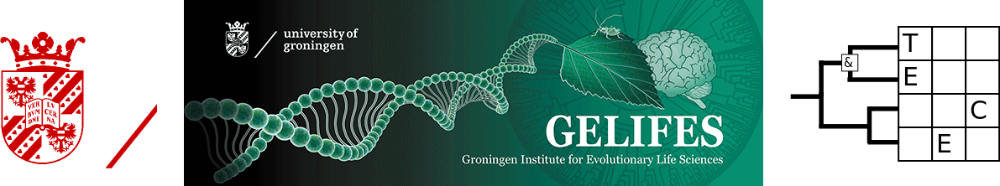

From alignment to Bayes factor
========================================================
author: Richel J.C. Bilderbeek
date: 2018-09-24
autosize: true

[https://github.com/richelbilderbeek/Science](https://github.com/richelbilderbeek/Science)  



Goal
========================================================

Show some aspects of phylogenetic research
  * Driven by research questions 
  * Bayesian approach
  * Model comparison
  * first, using BEAST2
  * second, using `babette`

***


Research questions
========================================================


***
 * 1. Whom are closest related?
 * 2. Who lived when?
 * 3. Which model to use?

1. Whom are closest related?
========================================================


***
And is it really that clear-cut?

What do we have?
========================================================


```r
alignment <- ape::read.FASTA(
  "primates.fas"
)
```

```r
image(alignment)
```
***


What tool do we use?
========================================================

 * BEAST2: Bayesian Evolutionary Analysis by Sampling Trees
 * Widely used
 * Use to get started
 
***


Demo
========================================================

Show how to:

 * View the posterior phylogenies
 * View the trace
 * View the effective sample size

Demo pictures
========================================================


***


Conclusion
========================================================

***


But ... how often?
========================================================


```r
library(babette)
```

```r
trees <- parse_beast_trees(
  "primates.trees"
)[51:100]
```

```r
plot_densitree(trees)
```
***


But ... how often?
========================================================


```r
has_canonical_topology <- function(tree) {
  !is.na(stringr::str_match(
    ape::write.tree(tree), 
    "siamang:[0-9\\.]+\\):0;")[1][1])
}
count_canonical_topologies <- function(trees) {
  n <- 0
  for (tree in trees) {
    n <- n + has_canonical_topology(tree)
  }
  n
}
count_canonical_topologies(trees) # out of 50
```

```
[1] 41
```

Discussion
========================================================

 * 41 out of 50 phylogenies follow the canonical topology 
 * Effective sample size is below the recommended 200
 * Undated nodes
 * Use JC69 site model and Yule (Pure-Birth) speciation model

2. Who lived when?
========================================================
