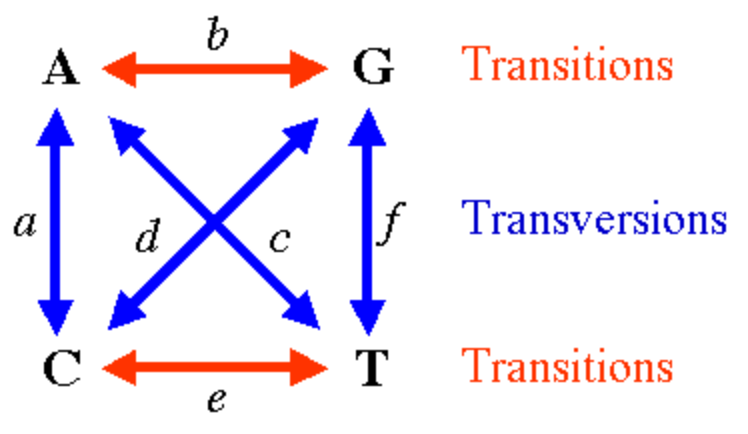
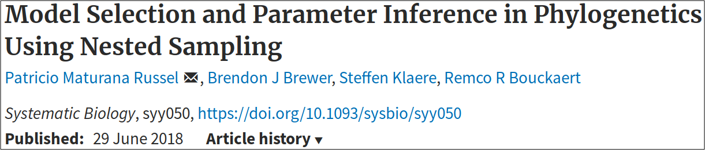

From alignment to Bayes factor
========================================================
author: Richel J.C. Bilderbeek
date: 2018-09-24
autosize: true

[https://github.com/richelbilderbeek/Science](https://github.com/richelbilderbeek/Science)  


Goal
========================================================

Show some aspects of phylogenetic research
  * Driven by research questions
  * Bayesian inference
  * Bayesian model comparison
  * Using BEAST2 and `babette`

***


Research questions
========================================================


***
 * 1. Who are closest related?
 * 2. Who lived when?
 * 3. Which model to use?

1. Who are closest related?
========================================================


***
And is it really that clear-cut?

What do we have?
========================================================


```r
fasta_filename <- "primates.fas"
alignment <- ape::read.FASTA(
  fasta_filename
)
```

```r
image(alignment)
```
***


What tool do we use?
========================================================

 * BEAST2: Bayesian Evolutionary Analysis by Sampling Trees
 * Widely used
 * Easy to get started

***


Demo
========================================================

Show how to:

 * View the posterior phylogenies
 * View the trace
 * View the effective sample size

Demo pictures
========================================================


***


Conclusion
========================================================

***


But ... how often?
========================================================


```r
library(babette)
```

```r
trees <- parse_beast_trees(
  "primates_undated.trees"
)[51:100]
```

```r
plot_densitree(trees)
```
***


But ... how often?
========================================================


```r
has_canonical_topology <- function(tree) {
  !is.na(stringr::str_match(
    ape::write.tree(tree),
    "siamang:[0-9\\.]+\\):0;")[1][1])
}
count_canonical_topologies <- function(trees) {
  n <- 0
  for (tree in trees) {
    n <- n + has_canonical_topology(tree)
  }
  n
}
```

But ... how often?
========================================================


```r
count_canonical_topologies(trees) # out of 50
```

```
[1] 36
```

Do the same with `babette`
========================================================


***
 * Create an MCMC
 * Run

Do the same with `babette`
========================================================


```r
mcmc <- create_mcmc(chain_length = 100000)
count_canonical_topologies(
  bbt_run(
    "primates.fas",
    mcmc = mcmc
  )$primates_trees[51:100]
) # out of 50
```

```
[1] 34
```

Discussion
========================================================

 * Approximately 40 out of 50 phylogenies follow the canonical topology
 * Effective sample size is below the recommended 200
 * Undated nodes
 * Use JC69 site model and Yule (Pure-Birth) speciation model

2. Who lived when?
========================================================

***
 * But when?
 * Assume a crown age of 17.58 Mya (from Purvis, 1995)

Demo
========================================================
Show how to:

 * Setup BEAUti
 * View the dated posterior phylogenies
 * View the trace and effective sample sizes

Demo pictures
========================================================


Demo pictures
========================================================


Demo pictures
========================================================


Conclusion
========================================================

 * We can now estimate the time humans and chimps diverged


```r
get_divergence_time <- function(tree) {
  human_index <- which(tree$tip.label == "human")
  chimp_index <- which(tree$tip.label == "chimp")
  ape::dist.nodes(tree)[human_index, chimp_index] / 2.0
}
get_divergence_times <- function(trees) {
  ts <- NULL
  for (tree in trees) {
    ts <- c(ts, get_divergence_time(tree))
  }
  ts
}
```

Conclusion
========================================================


```r
trees <- parse_beast_trees(
  "primates_dated.trees"
)[51:100]
mean(get_divergence_times(trees))
```

```
[1] 5.760481
```

Do the same with `babette`
========================================================


***
 * Create an MRCA prior distribution
 * Create an MRCA prior
 * Run


Do the same with `babette`
========================================================

Specify the crown age:


```r
mrca_distr <- create_normal_distr(
  mean = create_mean_param(value = 17.58),
  sigma = create_sigma_param(value = 0.01)
)
```

Specify an MRCA prior containing all species:


```r
mrca_prior <- create_mrca_prior(
  get_alignment_id("primates.fas"),
  taxa_names = get_taxa_names("primates.fas"),
  mrca_distr = mrca_distr,
  is_monophyletic = TRUE
)
```

Do the same with `babette`
========================================================


```r
trees <- bbt_run(
  "primates.fas",
  mcmc = mcmc,
  mrca_priors = mrca_prior
)$primates_trees[51:100]
```

Do the same with `babette`
========================================================


```r
mean(get_divergence_times(trees))
```

```
[1] 6.153677
```

Discussion
========================================================

 * Trace has not converged
 * Effective sample size is below the recommended 200
 * Use JC69 site model and Yule (Pure-Birth) speciation model

3. Which model to use?
========================================================

***
Nucleotide substitution models:
 * JC69: all rates are the same
 * GTR: all rates can be different

But how to guard against overfitting?

Bayes factor
========================================================

```
     marginal likelihood model A
BF = ----------------------------
     marginal likelihood model B
```

 * Marginal likelihood is the probability of the data given the model

Bayes factor interpretation
========================================================

BF|Strength evidence
---|---
`0` to `10^0` | Negative
`10^0` to `10^0.5`|Barely worth mentioning
`10^0.5` to `10^1.0`|Substantial
`10^1.0` to `10^1.5`|Strong
`10^1.5` to `10^2.0`|Very strong
`10^2` and above|Decisive

Bayes factor interpretation
========================================================


```r
interpret_bayes_factor <- function(bayes_factor) {
  if (bayes_factor < 10^-2.0) "decisive for GTR"
  else if (bayes_factor < 10^-1.5) "very strong for GTR"
  else if (bayes_factor < 10^-1.0) "strong for GTR"
  else if (bayes_factor < 10^-0.5) "substantial for GTR"
  else if (bayes_factor < 10^0.0) "barely worth mentioning"
  else if (bayes_factor < 10^0.5) "barely worth mentioning"
  else if (bayes_factor < 10^1.0) "substantial for JC69"
  else if (bayes_factor < 10^1.5) "strong for JC69"
  else if (bayes_factor < 10^2.0) "very strong for JC69"
  else "decisive for JC69"
}
```

Estimating a marginal likelihood
========================================================



Demo
========================================================

Show in BEAST2.

```
<run id="mcmc" spec="beast.gss.NS" chainLength="100000" particleCount="1" subChainLength="5000" epsilon="1e-12">
```

Demo figures
========================================================


Demo figures
========================================================

***


Conclusion
========================================================

```
     e ^ -1940
BF = ---------- = e ^ -140
     e ^ -1800
```

Decisive support for the GTR model!

Do the same with `babette`
========================================================


 * Create a nested sampling MCMC
 * Run twice

Do the same with `babette`
========================================================

Setup the MCMC to use nested sampling:


```r
mcmc <- create_mcmc_nested_sampling(
  chain_length = 100000, sub_chain_length = 5000
)
```

Do the same with `babette`
========================================================

Run with JC69:


```r
ns_jc69 <- bbt_run(
  "primates.fas",
  site_models = create_jc69_site_model(),
  mcmc = mcmc,
  beast2_path = get_default_beast2_bin_path()
)$ns
```

Do the same with `babette`
========================================================

Run with GTR:


```r
ns_gtr <- bbt_run(
  "primates.fas",
  site_models = create_gtr_site_model(),
  mcmc = mcmc,
  beast2_path = get_default_beast2_bin_path()
)$ns
```

Do the same with `babette`
========================================================


```r
ns_jc69$marg_log_lik
```

```
[1] -1934.778
```

```r
ns_gtr$marg_log_lik
```

```
[1] -1798.523
```


```r
interpret_bayes_factor(
  exp(ns_jc69$marg_log_lik - ns_gtr$marg_log_lik)
)
```

```
[1] "decisive for GTR"
```

Discussion
========================================================

 * Effective sample size is below the recommended 200
 * Nested sampling setup was also short
 * We only compare two models

Overall conclusion
========================================================

 * Phylogenetic Bayesian inference is flexible
 * BEAST2 is beginner-friendly
 * `babette` allows advanced usage


***


Questions?
========================================================


***


`babette` family
========================================================


***


Bayes factor interpretation test
========================================================


```r
testit::assert(interpret_bayes_factor(1 / 123.0) == "decisive for GTR")
testit::assert(interpret_bayes_factor(1 / 85.0) == "very strong for GTR")
testit::assert(interpret_bayes_factor(1 / 12.5) == "strong for GTR")
testit::assert(interpret_bayes_factor(1 / 8.5) == "substantial for GTR")
testit::assert(interpret_bayes_factor(1 / 1.5) == "barely worth mentioning")
testit::assert(interpret_bayes_factor(0.99) == "barely worth mentioning")
testit::assert(interpret_bayes_factor(1.01) == "barely worth mentioning")
testit::assert(interpret_bayes_factor(1.5) == "barely worth mentioning")
testit::assert(interpret_bayes_factor(8.5) == "substantial for JC69")
testit::assert(interpret_bayes_factor(12.5) == "strong for JC69")
testit::assert(interpret_bayes_factor(85.0) == "very strong for JC69")
testit::assert(interpret_bayes_factor(123.0) == "decisive for JC69")
```
