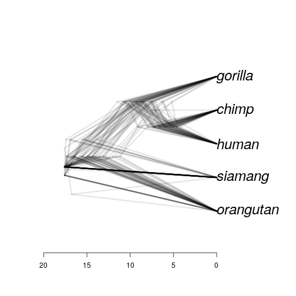
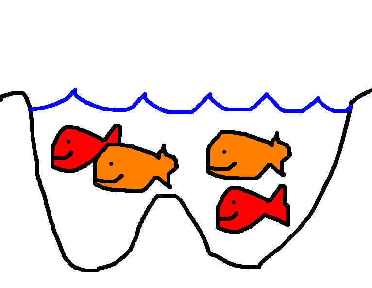

Today's errors in Bayesian phylogenetics
========================================================
author: Richel J.C. Bilderbeek
date: 2018-10-17
autosize: true

[https://github.com/richelbilderbeek/Science](https://github.com/richelbilderbeek/Science)  


A theoretician's dream
========================================================


Goal
========================================================


***
  * Explain Bayesian phylogenetics
  * Show analysis
  * Answer research question

Research questions
========================================================


***
 * Who lived when?
 * How complex should that calculation be?

What do we have?
========================================================


```r
fasta_filename <- "primates.fas"
alignment <- read.FASTA(
  fasta_filename
)
```

```r
image(alignment)
```
***


Where do we go?
========================================================


***
 * A posterior: phylogenies and parameter estimates


What tool could we use?
========================================================

 * BEAST2: Bayesian Evolutionary Analysis by Sampling Trees
 * Widely used
 * Easy to get started


*Bouckaert et al., 2014*

***


What tool do we use?
========================================================


*Bilderbeek & Etienne, 2018*

***
 * `babette`
 * Package to call BEAST2 from R
 * Completely automate pipeline


```r
library(babette)
```

Who lived when?
========================================================

 * Create a (too) short Markov chain Monte-Carlo:


```r
mcmc <- create_mcmc(chain_length = 100000)
```

Who lived when?
========================================================

 * Do the analysis


```r
trees <- bbt_run(
  "primates.fas",
  mcmc = mcmc
)$primates_trees[51:100]
```

Who lived when?
========================================================

 * Visualize the results


```r
plot_densitree(
  trees,
  alpha = 0.1,
  width = 3,
  cex = 2
)
```

 * So when exactly?

***


Who lived when?
========================================================

 * Specify the crown age:


```r
mrca_distr <- create_normal_distr(
  mean = create_mean_param(value = 17.58),
  sigma = create_sigma_param(value = 0.01)
)
```

*Purvis, 1995*

Who lived when?
========================================================

 * Specify an MRCA prior containing all species:


```r
mrca_prior <- create_mrca_prior(
  get_alignment_id("primates.fas"),
  taxa_names = get_taxa_names("primates.fas"),
  mrca_distr = mrca_distr,
  is_monophyletic = TRUE
)
```

Who lived when?
========================================================

 * Do the MCMC run


```r
trees <- bbt_run(
  "primates.fas",
  mcmc = mcmc,
  mrca_priors = mrca_prior
)$primates_trees[51:100]
```

Who lived when?
========================================================

 * Visualize the results


```r
plot_densitree(
  trees,
  alpha = 0.1,
  width = 3,
  cex = 2
)
```
`
***


How complex should that calculation be?
========================================================


***
 * Jukes-Cantor site model
 * Strict clock model
 * Constant-rate birth death tree model


Constant-rate birth death
========================================================


```r
tree <- pbtree(
  b = 0.2,
  d = 0.1,
  n = 10,
  extant.only = TRUE
)
```


```r
plot.phylo(
  tree,
  edge.width = 1,
  cex = 2
)
```
***


Constant-rate birth death assumptions
========================================================

 * Instantaneous speciation (*Fennessy et al., 2016*)


***

 * No co-occurence of speciation



Speciation takes time
========================================================


```r
pbd_tree <- bco_pbd_sim(
  create_pbd_params(
    erg = 0.2,
    eri = 0.2,
    scr = 0.01,
    sirg = 1.0,
    siri = 1.0
  ),
  crown_age = 2.0
)$igtree.extant
```

 * Protracted Birth-Death model

*Etienne & Rosindell, 2012*

***


Speciation can co-occur
========================================================


```r
mbd_tree <- bco_mbd_sim(
  create_mbd_params(
    lambda = 0.1,
    mu = 0.1,
    nu = 1.0,
    q = 0.5
  ),
  crown_age = 2.0
)$tes
```

 * Multiple Birth model
 * Laudanno et al., unpublished

***


What is the error we make today?
========================================================

 1. Create true tree
 2. Create DNA alignment
 3. Do Bayesian inference
 4. Compare posterior trees with true tree
 5. Does that error matter?


1. Create true tree
========================================================


```r
true_tree <- mbd_tree
```

```r
plot.phylo(true_tree)
```
***


2. Create DNA alignment
========================================================


```r
alignment <- sim_alignment(
  true_tree,
  sequence_length = 100,
  mutation_rate = 0.2
)
write.FASTA(alignment, "alignment.fas")
```


```r
image(alignment)
```
***


3. Do Bayesian inference
========================================================


```r
trees <- bbt_run(
  "alignment.fas",
  mcmc = mcmc
)$alignment_trees[51:100]
```


```r
plot_densitree(
  trees,
  alpha = 0.1,
  width = 3,
  cex = 2
)
```
`
***


4. Compare posterior trees with true tree
========================================================


```r
plot_densitree(
  c(true_tree, trees[[1]]),
  alpha = 1.0,
  scaleX = TRUE,
  width = c(6, 4),
  cex = 2,
  col = c("black", "red")
)
```
***


4. Compare posterior trees with true tree
========================================================


```r
nltt_plot(true_tree)
nltt_lines(trees[[1]], col = "red")
```

 * nLTT statistic: area between the lines

*Janzen et al., 2015*

***


4. Compare posterior trees with true tree
========================================================


```r
nltts <- nLTT::nltts_diff(true_tree, trees)
```


```r
ggplot(
  data = data.frame(error = nltts),
  aes(x = error)
) + geom_histogram()
```
***


5. Does that error matter?
========================================================


***

 * Background noise
 * Where are model parameters biologically relevant?

5. Does that error matter?
========================================================


***

*http://www.wvpublic.org/post/how-should-bible-be-taught-public-schools*

Summary
========================================================

 * Bayesian phylogenetics can seem easy
 * `babette` answers the core of a research question
 * ... but the details matter

References 1/2
========================================================

 * Bilderbeek, Richel JC, and Rampal S. Etienne. "babette: BEAU ti 2, BEAST 2 and Tracer for R." Methods in Ecology and Evolution (2018).
 * Bouckaert, R., Heled, J., Kühnert, D., Vaughan, T., Wu, C-H., Xie, D., Suchard, MA., Rambaut, A., & Drummond, A. J. (2014). BEAST 2: A Software Platform for Bayesian Evolutionary Analysis. PLoS Computational Biology, 10(4), e1003537. doi:10.1371/journal.pcbi.1003537
 * Etienne, Rampal S., and James Rosindell. "Prolonging the past counteracts the pull of the present: protracted speciation can explain observed slowdowns in diversification." Systematic Biology 61.2 (2012): 204-213.
 * Fennessy, Julian, et al. "Multi-locus analyses reveal four giraffe species instead of one." Current Biology 26.18 (2016): 2543-2549.

References 2/2
========================================================

 * Janzen, Thijs, Sebastian Höhna, and Rampal S. Etienne. "Approximate Bayesian Computation of diversification rates from molecular phylogenies: introducing a new efficient summary statistic, the nLTT." Methods in Ecology and Evolution 6.5 (2015): 566-575.
 * Purvis, Andy. "A composite estimate of primate phylogeny." Phil. Trans. R. Soc. Lond. B 348.1326 (1995): 405-421.

Questions?
========================================================


***

[https://github.com/ richelbilderbeek/Science](https://github.com/richelbilderbeek/Science)


[https://youtu.be/cp0F3W8KM0I](https://youtu.be/cp0F3W8KM0I)
