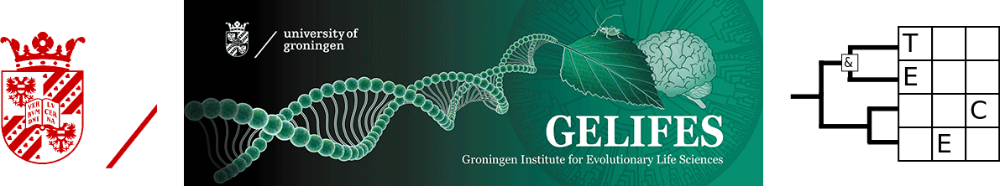

Asking the right questions?
========================================================
author: Richel J.C. Bilderbeek
date: 2018-12-11
autosize: true

[https://github.com/richelbilderbeek/Science](https://github.com/richelbilderbeek/Science)  



Goal
========================================================

 * Share a question I struggle with
 * Am I crazy?
 * Poll in the end

Question
========================================================

In a theoretical research, should one:

 * research question -> parameters
 * parameters -> research question
  

Example
========================================================

What is the effect of extinction on a birth-death process?

speciation rate|extinction rate|percentage extinct
---|---|---
0.2|0.0|derive
 |0.1|derive
 |0.2|derive
0.4|0.0|derive
 |0.1|derive
 |0.2|derive

```
percentage extinct = speciation rate / extinction rate
```

Example
========================================================

speciation rate|percentage extinct|extinction rate
---|---|---
0.2|0.0|derive
 |25|derive
 |50|derive
0.4|0.0|derive
 |25|derive
 |50|derive

```
extinction rate = speciation rate * percentage extinct
```

Two approaches to answer a research question
========================================================

Focus on:

 * parameters
 * research question

Paradox: focus on research question appears rare.
 
Focus on parameters
========================================================

Issue|Rating
---|---
Coverage of parameter space|Equally spaced
Interpretation|Distant from nature
Plots|Multiple facets
Appearance|Smart?


Focus on research question
========================================================

Issue|Rating
---|---
Coverage of parameter space|Inequally spaced
Interpretation|Close to nature
Plots|Single facet
Appearance|Oversimplification?
