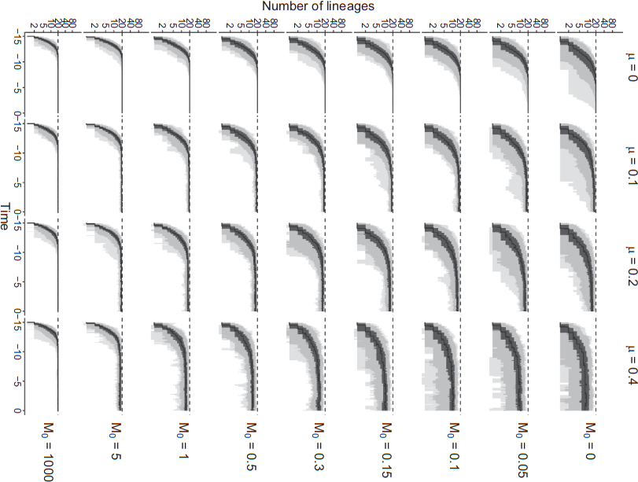
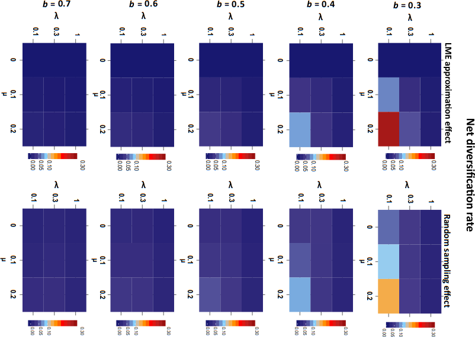

Asking the right questions?
========================================================
author: Richel J.C. Bilderbeek
date: 2018-12-11
autosize: true

[https://github.com/richelbilderbeek/Science](https://github.com/richelbilderbeek/Science)  


Goal
========================================================

 * Share a question I struggle with
 * Need opinion of others
 * Poll in the end

Research question: when to pick which one?
========================================================


***


Hypothesis
========================================================

# Starting from the process is better

***


Experiment
========================================================

 * Download all open access papers from TECE
 * Scan for figures that use either approach

Examples
========================================================


Examples
========================================================


Examples
========================================================



Examples
========================================================


Context: Birth-Death model
========================================================


```r
ape::plot.phylo(out$full_tree)
```


***

```r
ape::plot.phylo(out$reconstructed_tree)
```


Context: Birth-Death model
========================================================

 * Constant speciation rate, $\lambda \Leftarrow 5$
 * Constant extinction rate, $\mu \Leftarrow 2$
 * Expected fraction extinct: $< f_{\dagger}> \approx \frac{\mu}{\lambda} = \frac{2}{5}$


```r
#' Predict the proportion
#' of taxa that goes extinct
predict_f_extinct <- function(
  ext_rate,
  spec_rate
) {
  ext_rate / spec_rate
}
```
***


```r
print(
  predict_f_extinct(
    ext_rate = 2,
    spec_rate = 5
  )
)
```

```
[1] 0.4
```

Context: Birth-Death model
========================================================


```r
measure_f_extinct <- function(
  ext_rate,
  spec_rate
) {
  out <- becosys::bd_sim(
    create_bd_params(ext_rate = ext_rate, spec_rate = spec_rate),
    crown_age = 1
  )
  n <- ape::Ntip(out$full_tree)
  n_extinct <- n - ape::Ntip(out$reconstructed_tree)
  f_ext <- n_extinct / n
  f_ext
}
```

Context: Birth-Death model
========================================================


```r
print(measure_f_extinct(ext_rate = 2, spec_rate = 5))
```

```
[1] 0.40625
```


```r
print(predict_f_extinct(ext_rate = 2, spec_rate = 5))
```

```
[1] 0.4
```


Example: parameter-centric
========================================================

What is the effect of extinction on a birth-death process?


```r
df_par <- expand.grid(
  spec_rate = c(0.2, 0.4),
  ext_rate = c(0.0, 0.1, 0.2),
  frac_ext = NA
)
```
***

```r
knitr::kable(df_par)
```


| spec_rate| ext_rate|frac_ext |
|---------:|--------:|:--------|
|       0.2|      0.0|NA       |
|       0.4|      0.0|NA       |
|       0.2|      0.1|NA       |
|       0.4|      0.1|NA       |
|       0.2|      0.2|NA       |
|       0.4|      0.2|NA       |

Example: process-centric
========================================================


```r
df_proc <- expand.grid(
  spec_rate = c(0.2, 0.4),
  frac_ext = c(0.0, 0.25, 0.5),
  ext_rate = NA
)
```
***

```r
knitr::kable(df_proc)
```


| spec_rate| frac_ext|ext_rate |
|---------:|--------:|:--------|
|       0.2|     0.00|NA       |
|       0.4|     0.00|NA       |
|       0.2|     0.25|NA       |
|       0.4|     0.25|NA       |
|       0.2|     0.50|NA       |
|       0.4|     0.50|NA       |

Compare
========================================================


```r
df_par$frac_ext <- predict_f_extinct(
  df_par$ext_rate, df_par$spec_rate
)
knitr::kable(df_par)
```


| spec_rate| ext_rate| frac_ext|
|---------:|--------:|--------:|
|       0.2|      0.0|     0.00|
|       0.4|      0.0|     0.00|
|       0.2|      0.1|     0.50|
|       0.4|      0.1|     0.25|
|       0.2|      0.2|     1.00|
|       0.4|      0.2|     0.50|
***

```r
df_proc$ext_rate <-
  df_proc$spec_rate * df_proc$frac_ext
knitr::kable(df_proc)
```


| spec_rate| frac_ext| ext_rate|
|---------:|--------:|--------:|
|       0.2|     0.00|     0.00|
|       0.4|     0.00|     0.00|
|       0.2|     0.25|     0.05|
|       0.4|     0.25|     0.10|
|       0.2|     0.50|     0.10|
|       0.4|     0.50|     0.20|

Effect
========================================================

Assume the effect $e$ is dependent on the fraction that went exinct.

$$
e = f_{\dagger}^2 + 2 \cdot f_{\dagger} + 1
$$


```r
calc_effect <- function(frac_ext) {
  (frac_ext * frac_ext) + (2.0 * frac_ext) + 1
}
```


```r
df_par$effect <- calc_effect(df_par$frac_ext)
df_proc$effect <- calc_effect(df_proc$frac_ext)
```

Tileplot
========================================================


```r
tileplot <- function(df) {
  ggplot2::ggplot(
    df,
    aes(
      as.factor(spec_rate),
      as.factor(ext_rate),
      fill = effect
    )
  ) + geom_tile() +
  scale_fill_gradientn(colours = rainbow(100))
}
```

Tileplot
========================================================


```r
tileplot(df_par)
```


***

```r
tileplot(df_proc)
```


Lineplot
========================================================


```r
lineplot <- function(df) {
  ggplot2::ggplot(
    df,
    aes(frac_ext, effect, color = as.factor(spec_rate))
) + geom_jitter(size = 5, width = 0.01, height = 0.01) +
  geom_smooth(method = "lm")
}
```

Lineplot
========================================================


```r
lineplot(df_par)
```


***

```r
lineplot(df_proc)
```


Two approaches to answer a research question
========================================================

Focus on:

 * parameters
 * process

Paradox: focus on process appears rare.

Focus on parameters
========================================================

Issue|Rating
---|---
Coverage of parameter space|Equally spaced
Interpretation|Distant from nature
Plots|Multiple facets
Appearance|Smart?
Analysis|?


Focus on research question
========================================================

Issue|Rating
---|---
Coverage of parameter space|Inequally spaced
Interpretation|Close to nature
Plots|Single facet
Appearance|Oversimplification?
Analysis|?
