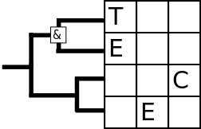
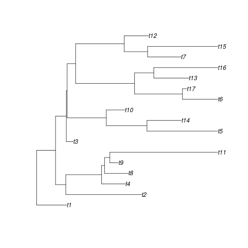

Picking the right approach
========================================================
author: Richel J.C. Bilderbeek
date: 2018-12-11
autosize: true

[https://github.com/richelbilderbeek/Science](https://github.com/richelbilderbeek/Science)  


Goal
========================================================

 * Make a case
 * Make a claim
 * Collect your ideas

***


```r
library(becosys)
library(ape)
library(ggplot2)
set.seed(42)
```

Research question
========================================================

When investigating an effect, should one

 * start from the parameters?
 * start from the process?

Or: when to pick which one?

***


Research question
========================================================


***


Hypothesis
========================================================

# Starting from the process is better

***


First experiment
========================================================

 * Download all open access papers from TECE 2017 and 2018 (n = 12)
 * Look for figures that use either approach

***



Results
========================================================


Results
========================================================


Results
========================================================


Results
========================================================


Results
========================================================


Results
========================================================


Results
========================================================


First conclusion
========================================================

Starting from parameters
appears popular

***


Research question again
========================================================

When investigating an effect, should one

 * start from the parameters?
 * start from the process?

Or: when to pick which one?

***


Context
========================================================


***


```r
out <- becosys::bd_sim(
  create_bd_params(
    ext_rate = 2,
    spec_rate = 5
  ),
  crown_age = 1
)
```


Context: Birth-Death model
========================================================


```r
plot.phylo(out$full_tree)
```


***

```r
plot.phylo(out$reconstructed_tree)
```


Context: Birth-Death model
========================================================

 * Constant speciation rate, $\lambda \Leftarrow 5$
 * Constant extinction rate, $\mu \Leftarrow 2$
 * Expected fraction extinct: $< f_{\dagger}> \approx \frac{\mu}{\lambda} = \frac{2}{5}$


```r
predict_f_extinct <- function(
  ext_rate,
  spec_rate
) {
  ext_rate / spec_rate
}
```
***


```r
print(
  predict_f_extinct(
    ext_rate = 2,
    spec_rate = 5
  )
)
```

```
[1] 0.4
```


Generate data: parameter-centric
========================================================

What is the effect of extinction on a birth-death process?


```r
df_par <- expand.grid(
  spec_rate = c(0.2, 0.4),
  ext_rate = c(0.0, 0.1, 0.2)
)
```
***

```r
knitr::kable(df_par)
```


| spec_rate| ext_rate|
|---------:|--------:|
|       0.2|      0.0|
|       0.4|      0.0|
|       0.2|      0.1|
|       0.4|      0.1|
|       0.2|      0.2|
|       0.4|      0.2|

Generate data: process-centric
========================================================

What is the effect of extinction on a birth-death process?


```r
df_proc <- expand.grid(
  spec_rate = c(0.2, 0.4),
  frac_ext = c(0.0, 0.25, 0.5)
)
```
***

```r
knitr::kable(df_proc)
```


| spec_rate| frac_ext|
|---------:|--------:|
|       0.2|     0.00|
|       0.4|     0.00|
|       0.2|     0.25|
|       0.4|     0.25|
|       0.2|     0.50|
|       0.4|     0.50|

Generate data: compare
========================================================


```r
df_par$frac_ext <- predict_f_extinct(
  df_par$ext_rate, df_par$spec_rate
)
knitr::kable(df_par)
```


| spec_rate| ext_rate| frac_ext|
|---------:|--------:|--------:|
|       0.2|      0.0|     0.00|
|       0.4|      0.0|     0.00|
|       0.2|      0.1|     0.50|
|       0.4|      0.1|     0.25|
|       0.2|      0.2|     1.00|
|       0.4|      0.2|     0.50|
***

```r
df_proc$ext_rate <-
  df_proc$spec_rate * df_proc$frac_ext
knitr::kable(df_proc)
```


| spec_rate| frac_ext| ext_rate|
|---------:|--------:|--------:|
|       0.2|     0.00|     0.00|
|       0.4|     0.00|     0.00|
|       0.2|     0.25|     0.05|
|       0.4|     0.25|     0.10|
|       0.2|     0.50|     0.10|
|       0.4|     0.50|     0.20|

Generate data: add effect
========================================================

Assume the effect $e$ is dependent on the fraction that went exinct.

$$
e = f_{\dagger}^2 + 2 \cdot f_{\dagger} + 1
$$


```r
calc_effect <- function(df) {
  (df$frac_ext * df$frac_ext) + (2.0 * df$frac_ext) + 1
  #(df$ext_rate * df$ext_rate) + (2.0 * df$ext_rate) + 1
  #(df$spec_rate * df$spec_rate) + (2.0 * df$spec_rate) + 1
  #1 + (4 * runif(n = nrow(df)))
}
```

Generate data: add effect
========================================================


```r
df_par$effect <- calc_effect(df_par)
knitr::kable(df_par)
```


| spec_rate| ext_rate| frac_ext| effect|
|---------:|--------:|--------:|------:|
|       0.2|      0.0|     0.00| 1.0000|
|       0.4|      0.0|     0.00| 1.0000|
|       0.2|      0.1|     0.50| 2.2500|
|       0.4|      0.1|     0.25| 1.5625|
|       0.2|      0.2|     1.00| 4.0000|
|       0.4|      0.2|     0.50| 2.2500|

***


```r
df_proc$effect <- calc_effect(df_proc)
knitr::kable(df_proc)
```


| spec_rate| frac_ext| ext_rate| effect|
|---------:|--------:|--------:|------:|
|       0.2|     0.00|     0.00| 1.0000|
|       0.4|     0.00|     0.00| 1.0000|
|       0.2|     0.25|     0.05| 1.5625|
|       0.4|     0.25|     0.10| 1.5625|
|       0.2|     0.50|     0.10| 2.2500|
|       0.4|     0.50|     0.20| 2.2500|

Analyse data
========================================================

Hypothesis: parameter-centric approach looks prettier

 * Tileplot vs lineplot
 * Extinct rate vs fraction extinct

Tileplot, rates
========================================================


```r
tileplot_rates <- function(df) {
  ggplot2::ggplot(
    df,
    aes(
      as.factor(spec_rate),
      as.factor(ext_rate),
      fill = effect
    )
  ) + geom_tile() +
  scale_fill_gradientn(
    colours = rainbow(
      100,
      end = 0.8
    ),
    limits = c(1, 4)
  ) +
  theme(
    axis.text = element_text(
      size = 20),
    axis.title = element_text(
      size = 20),
    legend.text = element_text(
      size = 20),
    legend.title = element_text(
      size = 20)
  )
}
```
***


Tileplot, rates
========================================================


```r
tileplot_rates(df_par)
```


***

```r
tileplot_rates(df_proc)
```


Tileplot, fraction
========================================================


```r
tileplot_fraction <- function(df) {
  ggplot2::ggplot(
    df,
    aes(
      as.factor(spec_rate),
      as.factor(frac_ext),
      fill = effect
    )
  ) + geom_tile() +
  scale_fill_gradientn(
    colours = rainbow(
      100,
      end = 0.8
    ),
    limits = c(1, 4)
  ) +
  theme(
    axis.text = element_text(
      size = 20),
    axis.title = element_text(
      size = 20),
    legend.text = element_text(
      size = 20),
    legend.title = element_text(
      size = 20)
  )
}
```
***


Tileplot, rates
========================================================


```r
tileplot_fraction(df_par)
```


***

```r
tileplot_fraction(df_proc)
```


Lineplot, fraction extinct
========================================================


```r
lineplot_f_ext <- function(df) {
  ggplot2::ggplot(
    df,
    aes(
      frac_ext,
      effect,
      color = as.factor(spec_rate)
    )
  ) + geom_jitter(
    size = 5,
    width = 0.01,
    height = 0.01
  ) +
  geom_smooth(method = "lm") +
  theme(
    axis.text = element_text(
      size = 20),
    axis.title = element_text(
      size = 20),
    legend.text = element_text(
      size = 20),
    legend.title = element_text(
      size = 20)
  )
}
```
***


Lineplot, fraction extinct
========================================================


```r
lineplot_f_ext(df_par)
```


***

```r
lineplot_f_ext(df_proc)
```


Lineplot, extinction rate
========================================================


```r
lineplot_ext_rate <- function(df) {
  ggplot2::ggplot(
    df,
    aes(
      ext_rate,
      effect,
      color = as.factor(frac_ext)
    )
  ) + geom_jitter(
    size = 5,
    width = 0.01,
    height = 0.01
  ) +
  geom_smooth(method = "lm") +
  theme(
    axis.text = element_text(
      size = 20),
    axis.title = element_text(
      size = 20),
    legend.text = element_text(
      size = 20),
    legend.title = element_text(
      size = 20)
  )
}
```
***


Lineplot, extinction rate
========================================================


```r
lineplot_ext_rate(df_par)
```


***

```r
lineplot_ext_rate(df_proc)
```


Preliminary conclusion
========================================================

I think, the process-centric approach is

 * easier to interpret biologically
 * resulting in a nicer plot 3 out of the 4 cases
 * underused

My question to you
========================================================

Which rule do you suggest,
when investigating an effect,
to

 * start from the parameters?
 * start from the process?

***


Questions?
========================================================


Measure the fraction extinct
========================================================


```r
measure_f_extinct <- function(
  ext_rate,
  spec_rate
) {
  out <- becosys::bd_sim(
    create_bd_params(
      ext_rate = ext_rate,
      spec_rate = spec_rate
    ),
    crown_age = 1
  )
  n <- Ntip(out$full_tree)
  n_extinct <- n -
    Ntip(out$reconstructed_tree)
  f_ext <- n_extinct / n
  f_ext
}
```

***


Measure the fraction extinct
========================================================


```r
print(measure_f_extinct(ext_rate = 2, spec_rate = 5))
```

```
[1] 0.3809524
```


```r
print(predict_f_extinct(ext_rate = 2, spec_rate = 5))
```

```
[1] 0.4
```
